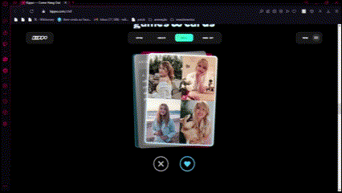
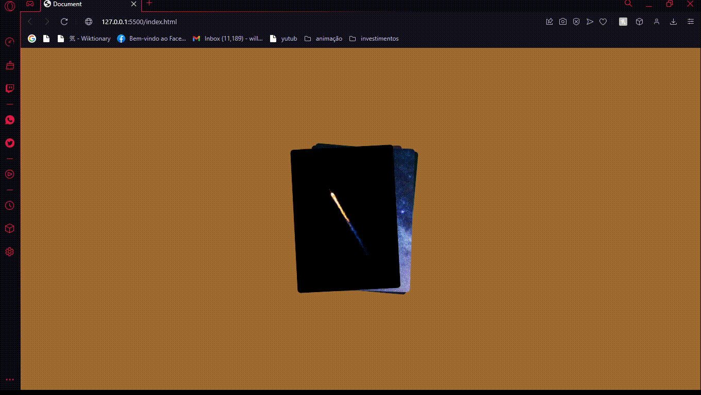

# cool-effect
Esse projeto é completamente inpirado pelo design que eu encontrei em um site.
<h2 align="center"> Origem da inspiração</h2>
A inspiração foi tirada desse site: https://kippo.com/chill/

esse vai ser um trabalho para testar minha capacidade de criar soluções para os designs que eu vejo pela internet

<h2 align="center"> Resultado</h2>

<h2 align="center"> Conclusão</h2>

Definitivamente não foi tão simples quanto eu esperava ao ver o design inicial, foi uma ótima experiência que me levou a aprender bastante sobre divs e a organização em grid

<h2 align="center">Tecnologias Utilizadas</h2>

     
   
       
       
    

data de inicio:20/12/22
data de termino:05/01/23
